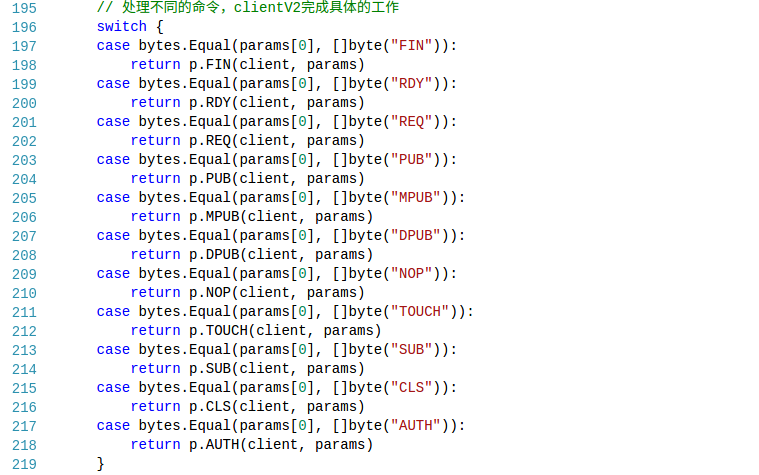

# nsqd介绍

### nsqd介绍

+ nsq是负责接收，排队，投递消息给客户端。它可以独立运行，不过通常它是由nsqd 实例所在集群配置的（它在这能声明 topics 和 channels，以便大家能找到）。

+ 它在 2 个 TCP 端口监听，一个给客户端，另一个是 HTTP API。同时，它也能在第三个端口监听 HTTPS。

+ TCP接口说明：

  + 处理消费者/生产者连接，协议部分在protocol_v2.go中实现，[详细代码](https://github.com/feixiao/nsq-0.3.7/blob/master/nsqd/protocol_v2.go)。支持的操作如下，详细请参考[TCP协议详细说明](http://nsq.io/clients/tcp_protocol_spec.html)

    

  + FIN命令

    + 作用

      告知Channel这个id的消息已经被成功的处理

    + 消息格式

      ```shell
      FIN <message_id>\n
      ```

      <message_id> - message id as 16-byte hex string

  + RDY命令

    + 作用

      更新状态，通知nsqd，消费者最多接收多少条数据

    + 消息格式

      ```shell
      RDY <count>\n
      ```

      <count> - a string representation of integer N where 0 < N <= configured_max

  + REQ命令

    + 作用

      要求nsqd重新排序该消息(暗示消息出来出错)

    + 消息格式

      ```
      REQ <message_id> <timeout>\n
      ```

      <message_id> - message id as 16-byte hex string
      <timeout> - a string representation of integer N where N <= configured max timeout.0 is a special case that will not defer re-queueing

  + PUB命令

    + 作用

      发送消息给指定的TOPIC

    + 消息格式

      ```
      PUB <topic_name>\n
      [ 4-byte size in bytes ][ N-byte binary data ]
      ```

      <topic_name> - a valid string (optionally having #ephemeral suffix)

  + MPUB命令

    + 作用

      发送多条消息给指定的TOPIC

    + 消息格式

      ```shell
      MPUB <topic_name>\n
      [ 4-byte body size ]
      [ 4-byte num messages ]
      [ 4-byte message #1 size ][ N-byte binary data ]
            ... (repeated <num_messages> times)
      ```

  +  DPUB命令(新版本已经废弃这个命令)

  + NOP命令(没有时间意义的命令，为什么存在？)

  + TOUCH命令

      + 作用

        重置待确认的消息的超时时间


      + 消息格式

        ```
        TOUCH <message_id>\n
        ```

  + SUB命令

    + 作用

      订阅某个topic下面的某个channel

    + 消息格式

      ```
      SUB <topic_name> <channel_name>\n
      ```

  + CLS命令

    + 作用

      关闭连接，没有消息会被发送

    + 消息格式

      ```
      CLS\n
      ```

  + AUTH命令

    + 作用

      认证(IDENTIFY)阶段如果auth_required=true，那么客户端必须在其他明确之前先进行认证

    + 消息格式

      ```
      AUTH\n
      [ 4-byte size in bytes ][ N-byte Auth Secret ]
      ```
