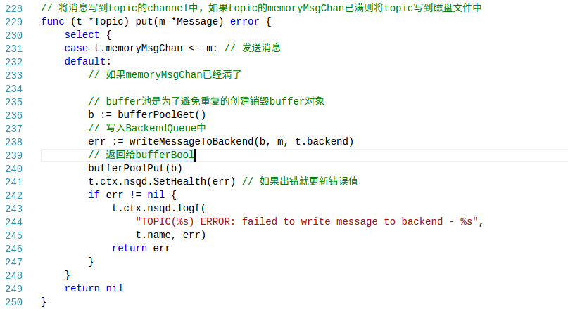
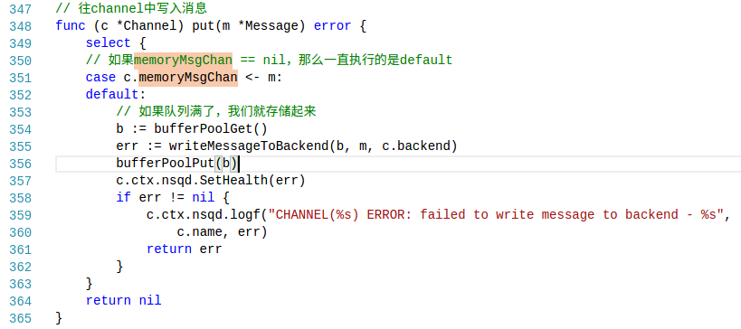

# nsqd的数据流

#### nsqd中关系的维护

+ 一个nsqd实例可以有多个Topic

  ```go
  topicMap map[string]*Topic
  ```

+ 一个Topic包含多个Channel

  ```go
  channelMap map[string]*Channel
  ```

+ 一个Channel下面含有多个Consumer

  ```go
  // state tracking
  clients   map[int64]Consumer // 维护该channel下面的Consumer
  ```

+ Consumer通过SUB命令来订阅某个Channel(之前需要使用IDENTIFY命令)

  **SUB命令主要如下**：

  

  **其中Channle.AddClient操作就是将client对象添加到clients结构中**

  

+ 完成订阅之后，查看生产者推送数据的逻辑，推送数据按协议来分有两种情况

  + HTTP方式

    + POST /pub		推送一个消息给某个指定的topic

    + POST /mpub         推送多个消息给某个指定的topic

      不管是pub还是mpub都是调用下面的函数

        messagePump中处理memoryMsgChan通道，关键代码如下：

      + 获取Topic下面的全部Channel

        ```
        	// 获取的到该Topic下面的全部Channel
        	for _, c := range t.channelMap {
        		chans = append(chans, c) // 保存topic下面的全部channel，下面用于分发数据
        	}
        ```


      + 获取要发送的数据

        ```go
        // msg来自两个地方
        case msg = <-memoryMsgChan: // 什么都不做，只是把消息分发出去
        case buf = <-backendChan:
        	msg, err = decodeMessage(buf)
        	if err != nil {
        		t.ctx.nsqd.logf("ERROR: failed to decode message - %s", err)
        		continue
        	}
        ```

      + 发送N份数据（msg被复制了多份然后发送给Channel）

        ```go
        // 将msg复制N份，发送到topic下的N个Channel中
        for i, channel := range chans {
        		chanMsg := msg
        		// copy the message because each channel
        		// needs a unique instance but...
        		// fastpath to avoid copy if its the first channel
        		// (the topic already created the first copy)
        		if i > 0 {
        			chanMsg = NewMessage(msg.ID, msg.Body)
        			chanMsg.Timestamp = msg.Timestamp
        			chanMsg.deferred = msg.deferred
        		}
        		if chanMsg.deferred != 0 {
                  	// 延迟发送的消息
        			channel.StartDeferredTimeout(chanMsg, chanMsg.deferred)
        			continue
        		}
          		// 立即发送的数据
        		err := channel.PutMessage(chanMsg)
        		if err != nil {
        			t.ctx.nsqd.logf(
        				"TOPIC(%s) ERROR: failed to put msg(%s) to channel(%s) - %s", t.name, msg.ID, channel.name, err)
        		}
        }
        ```

        注：其中chans会随着nsqd实例中的具体情况而变化，通过channelUpdateChan通道完成。

      + Channel发送数据：有两种行为，延迟发送消息和立即发送数据

        + 立即发送消息

          

          我们可以看到跟Topic的put方式一样的套路，Channel中同样存在函数messagePump处理memoryMsgChan通道

          + 获取需要发送的消息

            ```go
            select {
            	case msg = <-c.memoryMsgChan:
            	case buf = <-c.backend.ReadChan():
            		msg, err = decodeMessage(buf)
            		if err != nil {
            			c.ctx.nsqd.logf("ERROR: failed to decode message - %s", err)
            			continue
            		}
            	case <-c.exitChan:
            		goto exit
            }
            ```

          + 发送消息（将消息发送到clientMsgChan中）

            ```go
            msg.Attempts++ // 该变量用于保存投递尝试的次数。
            // 在消息投递前会将bufferedCount置为1，在投递后置为0。
            // 该变量在Depth函数中被调用。
            atomic.StoreInt32(&c.bufferedCount, 1)
            c.clientMsgChan <- msg 
            // 发送数据给clientMsgChan，在nsqd\protocol_v2.go的messagePump中处理
            atomic.StoreInt32(&c.bufferedCount, 0)
            ```

          + clientMsgChan的处理

            ​

        + 延迟发送消息

  + TCP方式